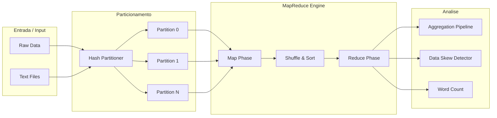
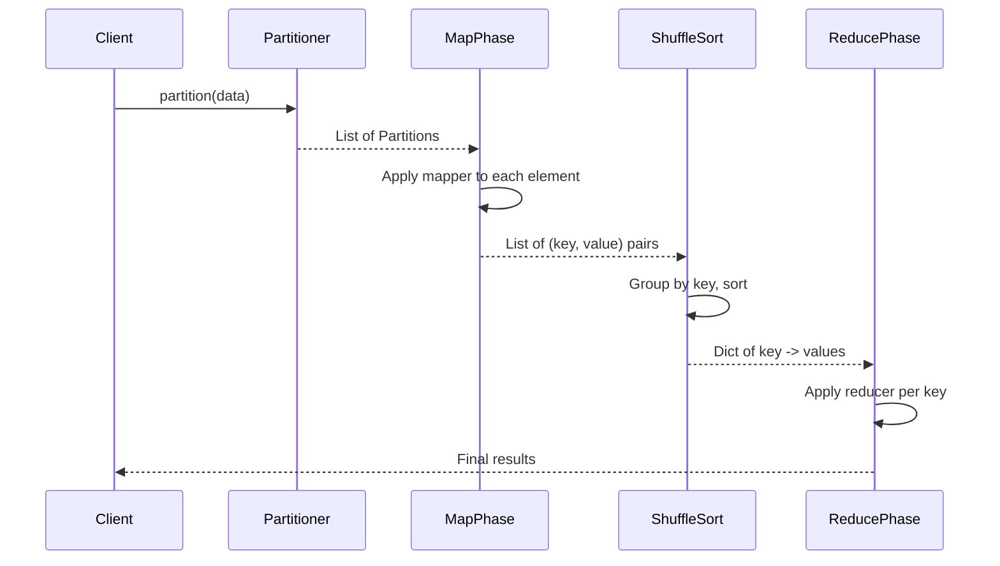

# Spark Big Data Processing


Framework simulador de processamento de big data inspirado no Apache Spark. Implementa MapReduce, particionamento de dados, shuffle/sort, word count, pipelines de agregacao e deteccao de data skew -- tudo sem dependencias externas de big data.

Big data processing framework simulator inspired by Apache Spark. Implements MapReduce, data partitioning, shuffle/sort, word count, aggregation pipelines, and data skew detection -- all without external big data dependencies.

---

## Arquitetura / Architecture



## Fluxo MapReduce / MapReduce Flow



## Funcionalidades / Features

| Funcionalidade / Feature | Descricao / Description |
|---|---|
| MapReduce Engine | Motor MapReduce com map, shuffle/sort e reduce / MapReduce engine with map, shuffle/sort and reduce phases |
| Partitioner | Particionamento hash-based configuravel / Configurable hash-based data partitioning |
| Word Count | Contagem de palavras classica via MapReduce / Classic word count via MapReduce |
| Aggregation Pipeline | API fluente para agregacoes encadeadas / Fluent API for chained aggregations (sum, avg, count, min, max) |
| Data Skew Detector | Deteccao de skew em particoes e hot-keys / Partition skew and hot-key detection |
| Sample Data Generator | Gerador de dados para testes / Test data generator with reproducible seeds |

## Inicio Rapido / Quick Start

```python
from src.processing_engine import word_count, AggregationPipeline, generate_sample_data

# Word Count
counts = word_count(["hello world hello", "world of data"])
# {'data': 1, 'hello': 2, 'of': 1, 'world': 2}

# Aggregation Pipeline
data = generate_sample_data(n=500)
result = (
    AggregationPipeline(data)
    .filter(lambda r: r["amount"] > 100)
    .group_by("region")
    .aggregate("amount", "sum")
    .sort("amount_sum", reverse=True)
    .execute()
)
```

## Testes / Tests

```bash
pytest tests/ -v
```

## Tecnologias / Technologies

- Python 3.9+
- pytest

## Licenca / License

MIT License - veja [LICENSE](LICENSE) / see [LICENSE](LICENSE).
